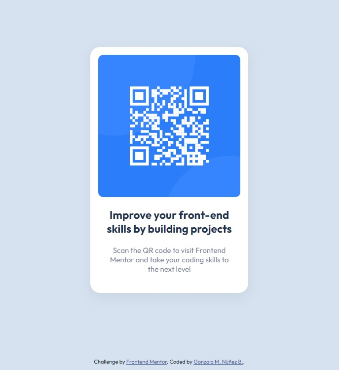

# Frontend Mentor - QR code component solution

This is a solution to the [QR code component challenge on Frontend Mentor](https://www.frontendmentor.io/challenges/qr-code-component-iux_sIO_H). Frontend Mentor challenges help you improve your coding skills by building realistic projects. 

## Table of contents

- [Overview](#overview)
  - [Screenshot](#screenshot)
  - [Links](#links)
- [My process](#my-process)
  - [Built with](#built-with)
  - [What I learned](#what-i-learned)
  - [Useful resources](#useful-resources)
- [Author](#author)

## Overview

This challenge is a very simple page showing a single card with a QR code image. A very good exercise for practicing HTML layouts and CSS styling.

### Screenshot

### Links

- Solution URL: [Find solution here](https://github.com/gnunez0101/gnunez0101.github.io)
- Live Site URL: [Find live site here](https://gnunez0101.github.io/qr-code/)

## My process

My process to tacke this challenge began from the outside to the inner parts of the layout, writing first the HTML to accomodate the parts and finally styling everything with CSS.

### Built with

- Semantic HTML5 markup
- CSS custom properties
- Flexbox
- CSS Grid
- CSS Nesting

### What I learned

With this practice I've learned to write Markdown. This is my first time using it.

### Useful resources

- [PicPick](https://picpick.app/en/) - Very useful tools for web development tasks, like measuring of pixels on image and a very nice color picker.

## Author

- LinkedIn - [Gonzalo Manuel Núñez](https://www.linkedin.com/in/gnunez0101)
- Frontend Mentor - [@gnunez0101](https://www.frontendmentor.io/profile/gnunez0101)

